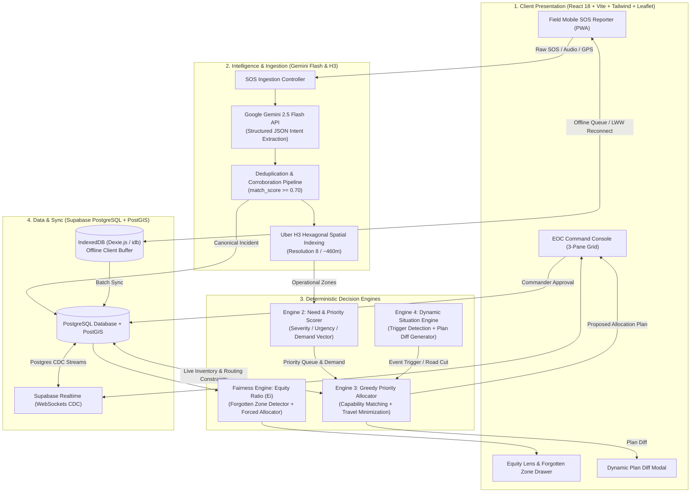

# ARCHITECTURE.md — ResQ Technical Architecture & Data Contracts
## Multi-Agency Disaster Decision Support Platform (MUJHACKX 2026)

---

## 1. High-Level Architecture

ResQ operates across four synchronized computational tiers: presentation, intelligence, deterministic optimization, and persistent storage.



---

## 2. The 3-Tier Information Model

```
TIER 1: MULTIMODAL INGESTION STREAM
  Raw inbound signals: Web forms, voice calls, sensor uplinks, field photos.
  ↓
  [Gemini Flash structured extraction + Deduplication matching]
  ↓
TIER 2: CANONICAL INCIDENT OBJECTS
  Deduplicated ground-truth records with calculated severity, urgency, confidence,
  and anti-phantom demand population counts (max of corroborating reports).
  ↓
  [Uber H3 Hexagonal Tessellation - Resolution 8]
  ↓
TIER 3: SPATIAL OPERATIONAL HEX ZONES
  Hexagonal demand clusters aggregating cumulative need weights, vulnerable demographics,
  and live Fulfilled Need Ratios (Ei = Deployed / Need).
```

---

## 3. Database Schema (PostgreSQL + PostGIS)

```sql
-- 1. Reports (Raw Inbound Signals)
CREATE TABLE reports (
  id UUID PRIMARY KEY DEFAULT gen_random_uuid(),
  report_id TEXT UNIQUE NOT NULL,
  source_type TEXT CHECK (source_type IN ('FORM','TEXT','VOICE','IMAGE','AGENCY_API','CONTROL_ROOM')),
  reporter_role TEXT CHECK (reporter_role IN ('NDRF','SDRF','POLICE','HOSPITAL','NGO_FIELD','CIVILIAN','SENSOR')),
  reporter_name TEXT,
  raw_content TEXT,
  extracted_data JSONB,
  location_text TEXT,
  location_coords GEOMETRY(Point, 4326),
  submitted_at TIMESTAMPTZ DEFAULT NOW(),
  is_processed BOOLEAN DEFAULT FALSE,
  incident_id UUID,
  credibility_score DECIMAL(3,2) DEFAULT 0.65
);

-- 2. Incidents (Canonical Deduplicated Events)
CREATE TABLE incidents (
  id UUID PRIMARY KEY DEFAULT gen_random_uuid(),
  incident_id TEXT UNIQUE NOT NULL,
  h3_index VARCHAR(20) NOT NULL,
  location GEOMETRY(Point, 4326) NOT NULL,
  event_type TEXT CHECK (event_type IN ('FLOOD','EARTHQUAKE','FIRE','LANDSLIDE','CYCLONE','MEDICAL_SURGE','OTHER')),
  status TEXT DEFAULT 'ACTIVE' CHECK (status IN ('ACTIVE','RESOLVED','DUPLICATE','CLOSED')),
  affected_count INT DEFAULT 0,
  trapped_count INT DEFAULT 0,
  injured_count INT DEFAULT 0,
  children_count INT DEFAULT 0,
  elderly_count INT DEFAULT 0,
  severity_score FLOAT NOT NULL,
  urgency_score FLOAT NOT NULL,
  priority_score FLOAT NOT NULL,
  confidence_score FLOAT NOT NULL,
  access_status TEXT DEFAULT 'OPEN' CHECK (access_status IN ('OPEN','PARTIAL','BLOCKED')),
  report_count INT DEFAULT 1,
  created_at TIMESTAMPTZ DEFAULT NOW(),
  updated_at TIMESTAMPTZ DEFAULT NOW()
);

-- 3. Assets (Multi-Agency Resource Inventory)
CREATE TABLE assets (
  id UUID PRIMARY KEY DEFAULT gen_random_uuid(),
  asset_code VARCHAR(50) UNIQUE NOT NULL,
  agency_owner VARCHAR(50) NOT NULL, -- NDRF, SDRF, POLICE, HOSPITAL, NGO
  name VARCHAR(100) NOT NULL,
  category TEXT CHECK (category IN ('MEDICAL','SEARCH_RESCUE','FLOOD_WATER','FIRE','SHELTER','SUPPLY')),
  sub_type VARCHAR(50) NOT NULL,
  capabilities JSONB NOT NULL,
  capacity INT NOT NULL,
  current_status TEXT DEFAULT 'AVAILABLE' CHECK (current_status IN ('AVAILABLE','ASSIGNED','EN_ROUTE','ON_SITE','PARTIALLY_USED','RETURNING','DAMAGED','OFFLINE')),
  current_location GEOMETRY(Point, 4326) NOT NULL,
  battery_level FLOAT DEFAULT 1.0,
  speed_kmh FLOAT DEFAULT 40.0,
  assigned_incident_id UUID REFERENCES incidents(id),
  updated_at TIMESTAMPTZ DEFAULT NOW()
);

-- 4. Allocation Plans & Dispatches
CREATE TABLE allocation_plans (
  id UUID PRIMARY KEY DEFAULT gen_random_uuid(),
  plan_code VARCHAR(50) UNIQUE NOT NULL,
  generated_at TIMESTAMPTZ DEFAULT NOW(),
  status TEXT DEFAULT 'PENDING' CHECK (status IN ('PENDING','APPROVED','PARTIALLY_APPROVED','REJECTED','SUPERSEDED')),
  authorizing_commander TEXT,
  trigger_reason TEXT DEFAULT 'INITIAL_OPTIMIZATION',
  plan_summary JSONB NOT NULL
);

CREATE TABLE plan_assignments (
  id UUID PRIMARY KEY DEFAULT gen_random_uuid(),
  plan_id UUID REFERENCES allocation_plans(id) ON DELETE CASCADE,
  asset_id UUID REFERENCES assets(id),
  incident_id UUID REFERENCES incidents(id),
  target_h3_index VARCHAR(20) NOT NULL,
  travel_time_minutes FLOAT NOT NULL,
  match_score FLOAT NOT NULL,
  reasoning_text TEXT NOT NULL,
  is_equity_forced BOOLEAN DEFAULT FALSE,
  status TEXT DEFAULT 'PENDING' CHECK (status IN ('PENDING','ACCEPTED','DISPATCHED','REJECTED'))
);

-- 5. Audit Log (Immutable Commander Ledger)
CREATE TABLE audit_log (
  id UUID PRIMARY KEY DEFAULT gen_random_uuid(),
  event_timestamp TIMESTAMPTZ DEFAULT NOW(),
  actor_id TEXT NOT NULL,
  action_type TEXT NOT NULL,
  plan_id UUID,
  details JSONB NOT NULL
);
```

---

## 4. API & Engine Contracts

### `POST /api/reports`
Ingests unstructured distress signal, triggers Gemini Flash extraction, executes deduplication pipeline, and writes to Canonical Incidents.

### `GET /api/zones/priority`
Returns all active Uber H3 hex clusters with aggregated casualty counts, demand vectors, priority scores, and $E_i$ fulfilled need ratios.

### `POST /api/allocation/run`
Executes the deterministic greedy optimizer across active zones and available resources. Returns proposed plan with per-assignment explainability rationales.

### `POST /api/reallocation/trigger`
Executes on environmental events (`ROUTE_BLOCKED`, `NEW_CRITICAL_INCIDENT`). Returns a structured Plan Diff:
```json
{
  "trigger": "ROAD_BLOCKED: NH-07 Washed Out at Helang Bridge Km 18",
  "affected_assignments_count": 2,
  "diff": [
    {
      "asset_code": "AMB-SDRF-04",
      "action": "REROUTED",
      "old_eta_minutes": 38,
      "new_eta_minutes": 56,
      "route": "Chopta Pass Detour",
      "reason": "Avoid severed Helang mountain bridge"
    }
  ]
}
```

---

## 5. Offline CRDT & IndexedDB Sync Protocol

```
1. Field Device Loses Connectivity (navigator.onLine === false)
2. UI displays non-blocking "DEGRADED MODE" indicator
3. Local reports stored in IndexedDB ('resq_offline_reports')
4. Each report tagged with client UUID and monotonic logical timestamp
5. Connectivity Restored (window.ononline)
6. Client flushes buffer in FIFO order to /api/reports/batch
7. Server validates and runs Fusion deduplication
8. Client receives confirmation, clears buffer, and emits toast: "🟢 3 Reports Synced"
```
