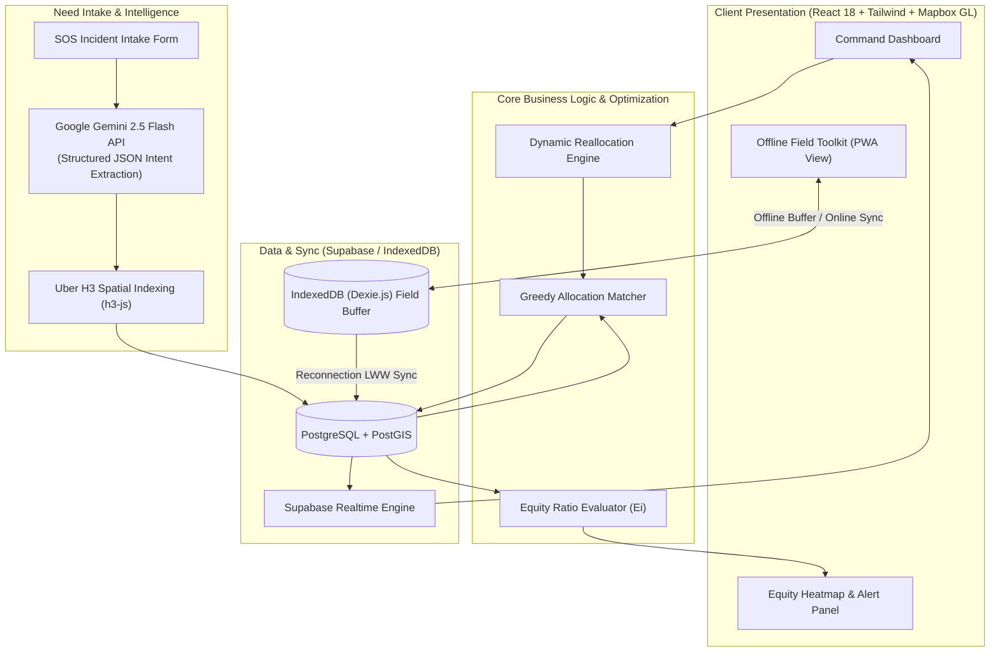

# MVP Implementation Plan: Search & Rescue Resource Allocation System (ResQ)
### 36-Hour Hackathon Scope | Problem Statement #2

## System Vision & Hackathon Reality

The pitch-deck vision describes a military-grade, multi-agency disaster coordination platform with computer vision, multispectral drone uplinks, MILP optimization solvers, and Kafka buses. 

This **36-Hour Hackathon MVP** ruthlessly prunes theoretical complexity to deliver an end-to-end, visually arresting, and fully functional operational prototype named **ResQ**. Every module built directly supports the 5 critical live demo checkpoints while remaining strictly achievable within the 36-hour sprint.

---

## Key Architectural Shift: Gemini 2.5 Flash Integration

> [!IMPORTANT]
> **LLM Engine Transition**: Replaces external Groq/Llama or Claude references with the **Google Gemini API** (`gemini-2.5-flash`) via the official `@google/genai` SDK.
> - **Structured JSON Output**: Gemini 2.5 Flash uses native schema enforcement (`responseSchema`) to extract deterministic JSON from messy, unstructured SOS messages in under **1.2 seconds**.
> - **Cost & Rate Limits**: Generous free/hackathon tier with zero cold starts, ideal for fast real-time intake.
> - **Multilingual SOS Resilience**: Native understanding of Hindi, regional Indian dialects, broken English, and urgent shorthand.

---

## 36-Hour Scope Breakdown: Built vs. Deferred

| Capability Area | Full SRS Vision (Pitch Deck) | 36-Hour MVP Implementation (Working Code) | Strategic Hackathon Justification |
| :--- | :--- | :--- | :--- |
| **LLM Need Intake** | Multimodal Whisper voice + CV thermal sign detection | **Gemini 2.5 Flash** text SOS parser (Web form + Quick-preset buttons) | No reliable thermal dataset; text-based LLM parsing demos reliably and fast. |
| **Spatial Grouping** | Uber H3 Hexagonal clustering (Res 7/8) | **Uber H3 (`h3-js`)** live client-side & edge indexing | Hexagons look incredible on Mapbox and enable mathematical equity calculations. |
| **Allocation Engine** | Full OR-Tools Mixed Integer Linear Programming (MILP) with time windows | **Greedy Nearest-Capable Matcher** (Haversine distance + asset capability + battery check) | Instant execution (<50ms), predictable demo behavior, zero solver crashes during judging. |
| **Routing** | OSRM road graph with flood penalties & airspace rules | **Straight-line / Polyline bearing** + manual "Route Blocked" simulation toggle | Eliminates dependency on self-hosting OSRM servers while proving dynamic rerouting. |
| **Realtime Sync** | Kafka / NATS enterprise message bus | **Supabase Realtime (Postgres CDC)** via WebSockets | Zero-infrastructure real-time pub/sub natively supported in React. |
| **Equity Metric** | Macro demographic vulnerability cross-referencing | **Live $E_i = \frac{\text{Resources Deployed}}{\text{Cumulative Need Weight}}$** per H3 hex | Computes in real time; visual red/yellow/green polygons clearly demonstrate fairness. |
| **Offline Resilience**| SQLite Wasm + CRDT state sync | **IndexedDB (Dexie.js) buffer + Last-Write-Wins (LWW) sync** | Fully proves disconnected field reporting with an intuitive "Offline" UI toggle. |

---

## Proposed System Architecture



---

## Data Schemas & Structural Definitions

### 1. `assets`
```sql
CREATE TABLE assets (
  id UUID PRIMARY KEY DEFAULT gen_random_uuid(),
  agency_owner VARCHAR(50) NOT NULL, -- e.g. 'NDRF', 'SDRF', 'Indian Army', 'Local Police'
  name VARCHAR(100) NOT NULL,        -- e.g. 'NDRF Rescue Boat Alpha-1'
  type VARCHAR(30) NOT NULL,         -- 'Boat', 'Truck', 'Drone', 'Medical_Unit'
  capabilities JSONB NOT NULL,       -- {"medical": true, "evac_capacity": 6, "thermal": true}
  battery_level FLOAT DEFAULT 1.0,   -- 0.0 to 1.0
  status VARCHAR(30) DEFAULT 'Available', -- 'Available', 'En-Route', 'Busy', 'Degraded', 'Offline'
  latitude FLOAT NOT NULL,
  longitude FLOAT NOT NULL,
  current_incident_id UUID REFERENCES incidents(id),
  updated_at TIMESTAMPTZ DEFAULT NOW()
);
```

### 2. `incidents` (SOS Reports)
```sql
CREATE TABLE incidents (
  id UUID PRIMARY KEY DEFAULT gen_random_uuid(),
  raw_message TEXT NOT NULL,
  need_type VARCHAR(50) NOT NULL,    -- 'Medical', 'Evacuation', 'Food_Water', 'Search_Rescue'
  people_count INT DEFAULT 1,
  priority_score FLOAT NOT NULL,     -- 0.1 (low) to 1.0 (critical)
  urgency_level VARCHAR(20) NOT NULL,-- 'Critical', 'High', 'Moderate'
  h3_index VARCHAR(20) NOT NULL,     -- Uber H3 Hex ID (Res 7 or 8)
  latitude FLOAT NOT NULL,
  longitude FLOAT NOT NULL,
  status VARCHAR(30) DEFAULT 'Open', -- 'Open', 'Assigned', 'In_Progress', 'Resolved'
  assigned_asset_id UUID REFERENCES assets(id),
  created_at TIMESTAMPTZ DEFAULT NOW()
);
```

### 3. `hex_equity_cache` (Computed or materialized view)
```sql
-- Evaluated dynamically in client or backend view:
-- Ei = (SUM(assigned assets capacity)) / (SUM(people_count * priority_score))
-- Red: Ei < 0.35 | Yellow: 0.35 <= Ei < 0.75 | Green: Ei >= 0.75
```

---

## Step-by-Step Implementation Roadmap (36-Hour Sprint)

### Step 1: Foundation & Seeded Disaster Environment (Hours 0 – 5)
- **Repo Setup**: Initialize modern React 18 + Vite + Tailwind CSS + Lucide Icons in `ResQ`.
- **Database / Backend**:
  - Connect Supabase project (or embed local mock Supabase client fallback with instant in-memory reactive state if offline/unconfigured).
  - Seed 15 realistic emergency assets across a designated disaster sector (e.g. Flash flood disaster in Uttarakhand Alaknanda/Mandakini riverine basin):
    - 4 NDRF Inflatable Rescue Boats
    - 4 Medical Field Ambulances / Mountain 4x4s
    - 4 Surveillance / Supply Delivery Drones
    - 3 Rapid Action Ground Search Squads (SDRF/ITBP)
  - Seed 8 initial multi-severity SOS incidents.

### Step 2: Gemini 2.5 Flash Intake & H3 Indexing (Hours 5 – 10)
- **Gemini API Service**:
  - Integrate `@google/genai` client using `gemini-2.5-flash`.
  - Prompt with schema constraint to parse messy SOS distress inputs:
    ```typescript
    const prompt = `You are a Search and Rescue Emergency Dispatch AI. Parse this distress call into structured emergency data.
    Input SOS: "${rawSosText}"`;
    // Returns: { need_type, people_count, priority_score, urgency_level, key_vulnerabilities }
    ```
- **H3 Hex Indexing**:
  - Install `h3-js`.
  - Convert `lat, lng` to H3 Hex index (`latLngToCell(lat, lng, 7)`).
  - Provide interactive SOS Simulator with 4 presets: "Rooftop Flood Trapped", "Injured Infant with Fever", "Collapsed Structure", "Cut-off Senior Citizens".

### Step 3: Command Dashboard & Mapbox Visualization (Hours 10 – 17)
- **Mapbox / MapLibre Engine**:
  - Multi-layer visual rendering:
    - Custom SVG markers for assets (color-coded by agency, pulsed when En-Route).
    - Distress pins with pulsing priority rings (Critical = Glowing Red).
    - H3 Hexagonal Grid polygons overlaid with transparent color fills.
- **Mission Control UI**:
  - Metric Header: Total Victims At Risk, Active Deployments, Fleet Readiness %, Critical Unmet Need Count.
  - Incident Triage Stream: Live cards with quick dispatch and direct inspector.
  - Asset Fleet Matrix: Battery levels, status pills, manual override toggles.

### Step 4: Greedy Allocation Engine (Hours 17 – 22)
- **Matching Algorithm**:
  ```typescript
  function matchResourceToIncident(incident, availableAssets) {
    // 1. Filter by capability (e.g. water evac requires 'Boat', medical requires 'Medical_Unit' or drone with first-aid)
    // 2. Compute Haversine distance (km)
    // 3. Score = (Distance * 0.6) - (Asset_Battery * 10)
    // 4. Return minimum score asset within operational range
  }
  ```
- **Visual Assignment**:
  - Draw dynamic dash lines between matched asset and incident coordinates on the map.
  - Compute estimated arrival time (ETA) based on vehicle standard velocity (Drone: 60km/h, Boat: 25km/h, Truck: 40km/h).

### Step 5: Dynamic Reallocation & Event Bus (Hours 22 – 27)
- **Supabase Realtime Sync**:
  - Subscribe to `postgres_changes` on `assets` and `incidents`.
  - Instant dispatch propagation to all open browser windows under 300ms.
- **Disruption Simulator Controls**:
  - **"Degrade Asset" Button**: Click on any en-route asset to simulate engine failure or battery depletion. Asset turns red (`status: 'Degraded'`).
  - **Auto-Rerouting Trigger**: The system immediately isolates the stranded incident, searches for the next best asset, and auto-reassigns it in real time.
  - Visual notification toast: *"Alert: Boat Alpha-1 Degraded! Auto-reallocating Incident #402 to Drone Beta-3."*

### Step 6: Equity Check & Fairness Heatmap (Hours 27 – 31)
- **Mathematical Fairness Formula**:
  $$E_i = \frac{\sum \text{Capacity of Deployed Assets in Hex } i}{\sum (\text{Victims}_j \times \text{Priority}_j)}$$
- **Visual Representation**:
  - H3 polygons dynamically rendered with choropleth shading:
    - **Crimson Red ($E_i < 0.35$)**: High urgency, critical neglect.
    - **Amber ($0.35 \le E_i < 0.75$)**: Partially addressed.
    - **Emerald Green ($E_i \ge 0.75$)**: Equitably covered.
- **"Least-Served Hexes" Alert Panel**:
  - Displays top 3 neglected hex zones to commanders.
  - "Auto-Balance" one-click button that prioritizes neglected hexes over already dense sectors.

### Step 7: Offline-First Field Toolkit (Hours 31 – 34)
- **Field Responder View**:
  - Clean, high-contrast, mobile-friendly interface designed for responders in boots.
  - Prominent **"Simulate Offline / Network Dead-Zone"** toggle.
- **IndexedDB Storage (`dexie`)**:
  - When offline: SOS victim reports and GPS location pings are written directly to local IndexedDB.
  - UI counter shows: *"Offline Mode Active — 3 Reports Queued in Local Buffer"*.
- **Sync Reconciliation**:
  - Toggling back to Online immediately triggers sync worker.
  - Flushes buffered reports to Supabase with Last-Write-Wins timestamps.
  - Commander dashboard reflects new field data within 500ms.

### Step 8: Rehearsal & Live Demo Script Tuning (Hours 34 – 36)
- Polish demo presentation script.
- Verify fallback demo mode with pre-cached simulated responses in case venue Wi-Fi becomes unstable.

---

## 5-Act Live Demo Script (Hackathon Presentation Flow)

```
[Act 1: Situational Awareness (30s)]
"Judges, in a catastrophic disaster, the first 72 hours decide who lives and who dies. 
Here is ResQ's Inter-Agency Command Dashboard showing Uttarakhand's flooded valley sectors with real-time NDRF, SDRF, and ITBP assets."

[Act 2: AI Need Intake via Gemini 2.5 Flash (45s)]
"Distress calls don't arrive as clean spreadsheets. Watch as we paste a panic-stricken message: 
'Water entering second floor near civil hospital, grandfather has cardiac pain, 3 kids stranded'.
Gemini 2.5 Flash extracts needs in 1.1s: Medical + Water Evac, Priority 0.95, and maps it directly to Uber H3 Hex 8728."

[Act 3: Instant Intelligent Matching (30s)]
"Our greedy allocation engine factors vehicle capability, battery, and proximity to dispatch 
NDRF Medical Boat Alpha-2, instantly drawing route lines with a 7-minute ETA."

[Act 4: Dynamic Reallocation on Failure (45s)]
"Disasters are unpredictable. Watch what happens when Boat Alpha-2 hits debris and reports an engine failure.
We trigger 'Degrade Asset'. In 200ms, the system reclaims the mission and automatically re-dispatches Medical Drone Beta-1."

[Act 5: Equity Heatmap & Offline Field Sync (60s)]
"Notice our Equity Layer: Hex 8729 is bright red because resources were hoarding around the main road. 
Now look at the Field Responder screen in an offline dead zone: the medic records 2 rescued victims offline, 
walks back into cell range, toggles online, and the commander's board updates instantly without data loss."
```

---

## Proposed Project File Structure (`MUJHACKX/ResQ`)

```
ResQ/
├── index.html
├── package.json
├── vite.config.ts
├── tailwind.config.js
├── src/
│   ├── main.tsx
│   ├── App.tsx
│   ├── types/
│   │   ├── asset.ts
│   │   ├── incident.ts
│   │   └── equity.ts
│   ├── services/
│   │   ├── gemini.ts           // Google Gemini 2.5 Flash structured parser
│   │   ├── h3Service.ts        // Uber H3 hex calculations & boundaries
│   │   ├── allocationEngine.ts // Greedy matching & capability solver
│   │   ├── equityEngine.ts     // Ei calculation & heatmap generator
│   │   ├── supabaseClient.ts   // Supabase client + realtime subscriptions
│   │   └── offlineDb.ts        // Dexie.js IndexedDB local buffer & sync
│   ├── components/
│   │   ├── Map/
│   │   │   ├── DisasterMap.tsx // Mapbox/MapLibre GL view
│   │   │   ├── AssetMarker.tsx
│   │   │   ├── IncidentMarker.tsx
│   │   │   └── H3HexLayer.tsx
│   │   ├── Dashboard/
│   │   │   ├── MetricHeader.tsx
│   │   │   ├── IncidentQueue.tsx
│   │   │   ├── FleetStatus.tsx
│   │   │   └── EquityAlertPanel.tsx
│   │   ├── Intake/
│   │   │   └── SosModal.tsx    // SOS text input with Gemini parser
│   │   └── FieldToolkit/
│   │       └── FieldView.tsx   // Offline-first responder view
│   └── data/
│       └── seedData.ts         // High-fidelity disaster initial seed
```

---

## Verification & Validation Plan

### Automated Checks
- `npm run build`: Typecheck and bundle verification.
- Unit test for Allocation Engine: Verify capability matching logic (e.g. medical request does not dispatch an unarmed cargo truck).
- Gemini API response schema validation: Ensure extracted output conforms strictly to `need_type`, `people_count`, and `priority_score`.

### Manual Demo Checkpoints
1. **Gemini Latency**: Ensure SOS text parsing completes within 2 seconds.
2. **Realtime Broadcast**: Open two browser windows side-by-side; trigger dispatch or failure in one, observe instantaneous UI update in the other.
3. **Hex Rendering**: Check that H3 hex coordinates project accurately onto the Mapbox tile coordinates without visual distortion.
4. **Offline Resilience**: Turn on DevTools Network "Offline" / App toggle, create 2 reports, restore connection, confirm database persistence.
